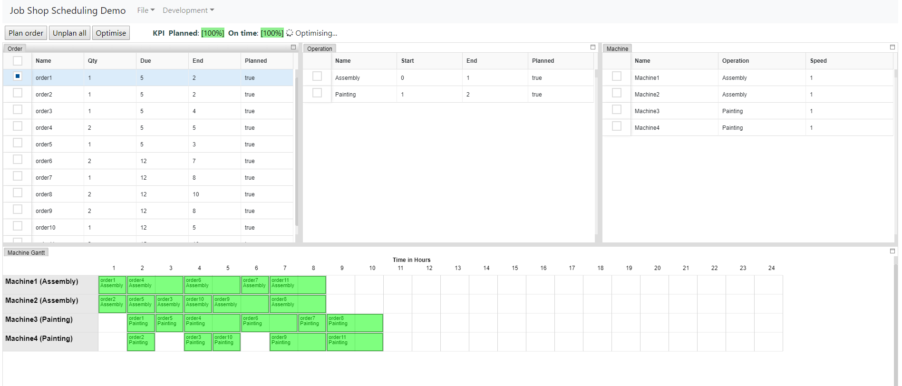

# JOB SHOP PLANNER DEMO

Job Shop Planner Demo using JS React as frontend and Python as optimiser/backend.

The goals of this project are the followings:
- To create react GUI components suitable for interactive planning solutions on the web ( Gantt Chart, etc..)
- To create a framework for building highly configurable planning solutions with rules expressed as logic or predicates.
- Configurable optimizer based on simplex solver. 
-
...

